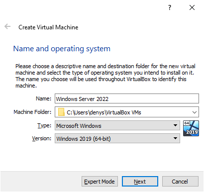

# UTS

### Objectives
- Instalasi windows server 2022
------

* ### Instalasi Windows Server 2022
  Required :
  + File ISO [Windows Server 2022](https://www.microsoft.com/en-us/evalcenter/evaluate-windows-server-2022)
  + Snack
  
  Lauch Virtual Box and Click button NEW
  
  
  
  Create Virtual Machine, Enter the name of machine, machine location , type, and version use windows 2019
  
  
  
  then install as usual
  
  Click VM and go to setting, at network changes attached to Bridged Adapter
  
  
  
  Start VM, you will see a pop up Select start-up disk, add the previously downloaded iso file
  
  
  
  Setting language, time and country, click Next
  
  
  
  Click Install now
  
  
  
  Select the Operating system you want to install , i am select Windows Server 2022 Standard Evaluation with Desktop experience, click next
  
  
  
  Accept Applicable notices and License terms, click next 

  In which type of installation use Custom , click next

  
  
  
  Partition location just click Next
  
  
  
  waiting for installation, it takes 10 - 30 minutes, get out your snack and relax a bit
  
  
  
  After installation conplete, Enter the Customize settings. and click finish
  
  
  
  On top click  input  > keyboard select Insert Ctrl+Alt+Del now you can insert password
  
  
  
  If you see pop up click X and minimize Server manager
  
  
  
  On top click Devices > Insert Guest Additions CD images
  
  
  
  
  Go to Document > CD Drive select application VBoxWindowsAdditions
  
  
  
  Just click Next, Next, install and Finish, VM will reboot 

  Type in search winver for check Windows Server 2022 is complete to install
  
  
  
  
  
  
* ## Instalasi Active Directory Domain Services
